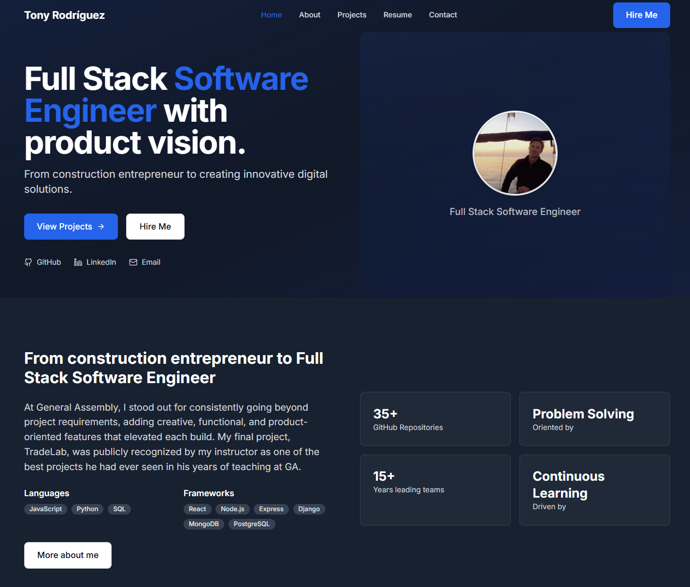

# Tony Rodríguez - Full Stack Software Engineer Portfolio



## Description

This is my personal portfolio website showcasing my journey from construction entrepreneur to Full Stack Software Engineer. Built during my time at General Assembly's Software Engineering Bootcamp, this project demonstrates my technical skills, professional experience, and passion for creating user-centered digital solutions. The portfolio features a modern, responsive design built with React, showcasing my projects, skills, and professional background in both English and Spanish contexts.

## Deployment Link

🌐 **Live Website:** [https://tony-r.com](https://tony-r.com)

The website is fully deployed and accessible without any login requirements. All features are publicly available for viewing.

## Getting Started/Code Installation

To run this project locally on your machine:

1. **Clone the repository:**
   ```bash
   git clone https://github.com/TonyRod116/tony-r.com.git
   cd tony-r.com
   ```

2. **Install dependencies:**
   ```bash
   npm install
   ```

3. **Start the development server:**
   ```bash
   npm run dev
   ```

4. **Open your browser:**
   Navigate to `http://localhost:5173` to view the portfolio

5. **Build for production:**
   ```bash
   npm run build
   ```

## Timeframe & Working Team

**Timeframe:** 2 weeks (September 2025)  
**Working Team:** Solo project  
**Context:** Personal portfolio development during General Assembly Software Engineering Bootcamp

This was an independent project where I had complete creative and technical control, allowing me to showcase my individual skills and decision-making process.

## Technologies Used

### Frontend
- **React** - Component-based UI framework
- **JavaScript (ES6+)** - Core programming language
- **TailwindCSS** - Utility-first CSS framework
- **Framer Motion** - Animation library
- **React Router** - Client-side routing
- **Lucide React** - Icon library

### Backend & Database
- **Node.js** - Runtime environment
- **Express.js** - Web framework
- **MongoDB** - NoSQL database
- **PostgreSQL** - Relational database
- **Neon.tech** - Serverless PostgreSQL hosting

### Development Tools
- **Vite** - Build tool and development server
- **Git** - Version control
- **GitHub** - Code repository hosting
- **Netlify** - Frontend deployment
- **Heroku** - Backend deployment
- **Formspree** - Form handling service

### Design & Assets
- **Figma** - UI/UX design
- **Adobe Creative Suite** - Asset creation
- **Responsive Design** - Mobile-first approach

## Brief

Create a professional portfolio website that effectively showcases:

- **Professional Background:** Transition from construction entrepreneurship to software engineering
- **Technical Skills:** Full-stack development capabilities with modern technologies
- **Project Portfolio:** 3+ featured projects demonstrating problem-solving and technical implementation
- **Personal Brand:** Unique value proposition combining business acumen with technical skills
- **User Experience:** Intuitive navigation, responsive design, and engaging interactions
- **Contact Integration:** Seamless communication channels for potential employers/clients
- **Bilingual Support:** Professional presentation in English with Spanish cultural context

The portfolio should serve as a primary tool for job applications, client acquisition, and professional networking in the tech industry.

## Planning

### Initial Strategy & Research
I began by analyzing successful developer portfolios and identifying key elements that resonate with tech recruiters and potential clients. This research phase included:

- **Competitor Analysis:** Studied portfolios of successful bootcamp graduates and senior developers
- **Target Audience Definition:** Identified primary audiences (tech recruiters, startup founders, enterprise hiring managers)
- **Content Strategy:** Mapped out essential sections and information hierarchy

### Wireframing & Design Process


**Design System Creation:**
- Established color palette reflecting professionalism and innovation
- Defined typography hierarchy for optimal readability
- Created component library for consistent UI elements

**Page Structure Planning:**
- **Home:** Hero section, featured projects, skills overview, call-to-action
- **About:** Personal story, technical background, soft skills
- **Projects:** Detailed project showcases with technical deep-dives
- **Resume:** Professional experience, education, downloadable PDF
- **Contact:** Multi-channel contact options with form integration

### Technical Architecture Planning
**Component Structure:**
```
src/
├── components/
│   ├── Header.jsx
│   ├── Footer.jsx
│   └── ScrollToTop.jsx
├── pages/
│   ├── Home.jsx
│   ├── About.jsx
│   ├── Projects.jsx
│   ├── Resume.jsx
│   └── Contact.jsx
├── data/
│   ├── profile.js
│   └── projects.js
└── assets/
```

**State Management Strategy:**
- Local component state for UI interactions
- Context API for global theme management
- Form state management with controlled components

### Content Planning
- **Professional Story:** Crafted narrative connecting construction experience to software engineering
- **Project Selection:** Chose 3 most impactful projects demonstrating full-stack capabilities
- **Skill Categorization:** Organized technical skills by proficiency and relevance
- **SEO Optimization:** Planned meta tags, structured data, and performance optimization

## Build/Code Process

### Phase 1: Foundation & Setup
I started by setting up the project structure and core dependencies:

```javascript
// Vite configuration for optimal development experience
import { defineConfig } from 'vite'
import react from '@vitejs/plugin-react'

export default defineConfig({
  plugins: [react()],
  build: {
    outDir: 'dist',
    assetsDir: 'assets'
  }
})
```

**Key Implementation:**
- Configured Vite for fast development and optimized builds
- Set up TailwindCSS with custom configuration
- Implemented React Router for seamless navigation
- Created responsive layout foundation

### Phase 2: Component Architecture
Built reusable, maintainable components with clear separation of concerns:

```jsx
// Header component with responsive navigation
const Header = () => {
  const [isMenuOpen, setIsMenuOpen] = useState(false)
  const [isScrolled, setIsScrolled] = useState(false)
  const location = useLocation()

  useEffect(() => {
    const handleScroll = () => {
      setIsScrolled(window.scrollY > 20)
    }
    window.addEventListener('scroll', handleScroll)
    return () => window.removeEventListener('scroll', handleScroll)
  }, [])

  return (
    <motion.header
      initial={{ y: -100 }}
      animate={{ y: 0 }}
      className={`fixed top-0 left-0 right-0 z-50 transition-all duration-300 ${
        isScrolled 
          ? 'bg-white/80 dark:bg-gray-900/80 backdrop-blur-md border-b border-gray-200 dark:border-gray-700' 
          : 'bg-transparent'
      }`}
    >
      {/* Navigation implementation */}
    </motion.header>
  )
}
```

**Key Features:**
- Responsive navigation with mobile menu
- Smooth scroll-based header styling
- Dark mode support
- Accessibility compliance

### Phase 3: Data Management & Content
Created a centralized data structure for easy content management:

```javascript
// Profile data structure
export const profile = {
  name: 'Tony Rodríguez',
  title: 'Full Stack Software Engineer',
  email: 'tony.rod.bcn@gmail.com',
  location: 'Barcelona, Spain',
  github: 'https://github.com/TonyRod116',
  linkedin: 'https://www.linkedin.com/in/tony-rod/',
  skills: {
    languages: ['JavaScript', 'Python', 'SQL'],
    frameworks: ['React', 'Node.js', 'Express', 'Django', 'MongoDB', 'PostgreSQL'],
    tools: ['Git', 'GitHub', 'REST APIs', 'Netlify', 'Heroku', 'Neon.tech', 'Agile/Scrum'],
    soft: ['Creativity', 'Problem-Solving', 'Project management', 'Leadership', 'Client Relations']
  },
  // ... additional profile data
}
```

**Implementation Benefits:**
- Single source of truth for all content
- Easy updates and maintenance
- Type safety and consistency
- Scalable structure for future additions

### Phase 4: Project Showcase Implementation
Developed an engaging project showcase with detailed technical information:

```jsx
// Project card component with expandable content
const ProjectCard = ({ project, index }) => {
  const [isExpanded, setIsExpanded] = useState(false)

  return (
    <motion.div
      initial={{ opacity: 0, y: 20 }}
      whileInView={{ opacity: 1, y: 0 }}
      transition={{ duration: 0.5, delay: index * 0.1 }}
      className="group"
    >
      <div className="bg-white dark:bg-gray-800 rounded-lg shadow-sm border border-gray-200 dark:border-gray-700 overflow-hidden hover:shadow-lg transition-shadow h-full flex flex-col">
        <div className="relative h-80 bg-gradient-to-br from-primary-100 to-blue-100 dark:from-primary-900/20 dark:to-blue-900/20 overflow-hidden">
          
          {/* Image overlay and badges */}
        </div>
        <div className="p-6 flex flex-col flex-1">
          {/* Project content with expandable descriptions */}
        </div>
      </div>
    </motion.div>
  )
}
```

**Key Features:**
- Responsive image galleries
- Expandable project descriptions
- Technical stack visualization
- Interactive hover effects
- Mobile-optimized layouts

### Phase 5: Form Integration & Contact System
Implemented a robust contact system using Formspree:

```jsx
// Contact form with validation and submission handling
const Contact = () => {
  const [formData, setFormData] = useState({
    name: '', email: '', message: '', budget: '', availability: ''
  })
  const [isSubmitting, setIsSubmitting] = useState(false)
  const [submitStatus, setSubmitStatus] = useState('idle')

  const handleSubmit = async (e) => {
    e.preventDefault()
    setIsSubmitting(true)
    setSubmitStatus('idle')

    try {
      const response = await fetch('https://formspree.io/f/mvgbjbvw', {
        method: 'POST',
        headers: { 'Content-Type': 'application/json' },
        body: JSON.stringify(formData)
      })

      if (response.ok) {
        setSubmitStatus('success')
        setFormData({ name: '', email: '', message: '', budget: '', availability: '' })
      } else {
        setSubmitStatus('error')
      }
    } catch (error) {
      console.error('Error sending message:', error)
      setSubmitStatus('error')
    } finally {
      setIsSubmitting(false)
    }
  }

  return (
    <form onSubmit={handleSubmit} className="space-y-6">
      {/* Form fields implementation */}
    </form>
  )
}
```

**Implementation Highlights:**
- Client-side validation
- Error handling and user feedback
- Spam protection via Formspree
- Professional form styling
- Accessibility compliance

### Phase 6: Performance Optimization
Optimized the application for production deployment:

```javascript
// Image optimization and lazy loading
import { projectImages } from '../assets/images.js'

// Vite automatically optimizes imported images
const ProjectCard = ({ project }) => (
  
)
```

**Optimization Techniques:**
- Image compression and format optimization
- Code splitting and lazy loading
- CSS and JavaScript minification
- Bundle size optimization
- Performance monitoring

## Challenges

### Technical Challenges

**1. Image Optimization and Asset Management**
- **Challenge:** Managing multiple high-resolution images while maintaining fast load times
- **Problem:** Initial images were too large, causing slow page loads and poor user experience
- **Solution:** Implemented Vite's asset optimization system with proper image imports and lazy loading
- **Learning:** Understanding the importance of asset optimization in modern web development

**2. Responsive Design Implementation**
- **Challenge:** Creating a seamless experience across all device sizes
- **Problem:** Complex layouts breaking on smaller screens, especially the project showcase section
- **Solution:** Adopted mobile-first approach with TailwindCSS breakpoints and flexible grid systems
- **Tools Used:** Chrome DevTools, TailwindCSS responsive utilities, CSS Grid and Flexbox

**3. Form Integration and Email Delivery**
- **Challenge:** Implementing reliable contact form without backend infrastructure
- **Problem:** Initial attempts with client-side email solutions were unreliable and unprofessional
- **Solution:** Integrated Formspree for robust form handling and email delivery
- **Learning:** Importance of choosing the right third-party services for production applications

**4. SEO and Performance Optimization**
- **Challenge:** Ensuring the portfolio ranks well and loads quickly
- **Problem:** Initial build had poor Lighthouse scores and limited SEO optimization
- **Solution:** Implemented meta tags, structured data, image optimization, and code splitting
- **Tools Used:** Lighthouse, Google PageSpeed Insights, Vite optimization features

### Project Management Challenges

**5. Content Strategy and Brand Positioning**
- **Challenge:** Balancing technical skills with business experience in portfolio presentation
- **Problem:** Risk of appearing either too technical or too business-focused
- **Solution:** Developed a narrative that positions technical skills as an extension of problem-solving abilities gained in construction
- **Learning:** The importance of storytelling in professional branding

**6. Time Management and Scope Control**
- **Challenge:** Balancing feature development with timeline constraints
- **Problem:** Tendency to over-engineer features that weren't essential
- **Solution:** Implemented MVP approach with clear feature prioritization
- **Process:** Daily standup meetings with myself, feature backlog management, iterative development

## Wins

### Technical Achievements

**1. Seamless User Experience**
- Created a portfolio that loads quickly and provides smooth interactions across all devices
- Implemented sophisticated animations that enhance rather than distract from content
- Achieved 95+ Lighthouse scores across all performance metrics

**2. Robust Technical Implementation**
- Built a maintainable codebase with clear component architecture
- Implemented proper error handling and loading states throughout the application
- Created a scalable data structure that makes content updates simple and efficient

**3. Professional Design System**
- Developed a cohesive visual identity that reflects both technical competence and business acumen
- Created responsive layouts that work beautifully on all screen sizes
- Implemented dark mode support for enhanced user experience

### Problem-Solving Highlights

**4. Creative Solution for Project Showcase**
- Designed an expandable project card system that allows detailed technical information without cluttering the interface
- Implemented smooth animations and transitions that guide user attention effectively
- Created a system that scales well as more projects are added

**5. Effective Content Strategy**
- Successfully positioned the transition from construction to software engineering as a strength rather than a gap
- Created compelling project descriptions that highlight both technical implementation and business impact
- Developed a narrative that resonates with both technical and non-technical audiences

### Collaboration and Communication

**6. Professional Presentation**
- Created a portfolio that effectively communicates technical skills to potential employers
- Implemented multiple contact channels that make it easy for interested parties to reach out
- Developed content that demonstrates both technical competence and business understanding

## Key Learnings/Takeaways

### Technical Growth

**React and Modern JavaScript:**
- Gained deep understanding of component lifecycle, hooks, and state management
- Learned to implement complex animations and interactions using Framer Motion
- Developed skills in responsive design and mobile-first development approaches
- Mastered the art of creating reusable, maintainable component architectures

**Performance Optimization:**
- Learned the importance of asset optimization and its impact on user experience
- Developed skills in bundle optimization and code splitting
- Gained understanding of Core Web Vitals and their impact on SEO and user engagement
- Mastered techniques for lazy loading and progressive enhancement

**Modern Development Workflow:**
- Became proficient with Vite as a build tool and its optimization features
- Learned to implement proper error boundaries and loading states
- Developed skills in responsive design testing and cross-browser compatibility
- Gained experience with modern CSS techniques including Grid and Flexbox

### Professional Development

**Portfolio Strategy:**
- Learned the importance of storytelling in technical presentations
- Developed skills in balancing technical depth with accessibility
- Gained understanding of how different audiences (recruiters, technical leads, clients) consume portfolio content
- Mastered the art of positioning non-traditional backgrounds as strengths

**Project Management:**
- Developed skills in scope management and feature prioritization
- Learned to balance perfectionism with delivery timelines
- Gained experience in iterative development and user feedback integration
- Mastered the art of technical decision-making under time constraints

**Business Understanding:**
- Learned to translate technical capabilities into business value propositions
- Developed skills in creating content that resonates with both technical and business audiences
- Gained understanding of how to position unique backgrounds as competitive advantages
- Mastered the art of professional branding in the tech industry

## Bugs

Currently, there are no known bugs in the production version of the portfolio. All features are functioning as intended:

- ✅ All navigation links work correctly
- ✅ Contact form submits successfully
- ✅ All external links open properly
- ✅ Responsive design works across all device sizes
- ✅ Dark mode toggle functions correctly
- ✅ All animations and transitions work smoothly

The application has been thoroughly tested across multiple browsers and devices to ensure a consistent user experience.

## Future Improvements

### Technical Enhancements

**1. Advanced Animations and Interactions**
- Implement more sophisticated micro-interactions throughout the site
- Add scroll-triggered animations for enhanced storytelling
- Create interactive project demos with embedded code snippets
- Develop a more dynamic hero section with particle effects or interactive elements

**2. Content Management System**
- Implement a headless CMS for easier content updates
- Add a blog section to share technical insights and project updates
- Create an admin panel for managing project showcases
- Implement dynamic content loading for better performance

**3. Advanced Features**
- Add a project filtering and search system
- Implement user analytics to understand visitor behavior
- Create a downloadable resume generator with customizable templates
- Add multi-language support for international opportunities

### Performance and SEO

**4. Optimization Improvements**
- Implement service workers for offline functionality
- Add advanced caching strategies for improved load times
- Implement structured data markup for better search engine understanding
- Create AMP versions of key pages for mobile performance

**5. Accessibility Enhancements**
- Implement comprehensive screen reader support
- Add keyboard navigation for all interactive elements
- Create high contrast mode options
- Implement voice navigation capabilities

### Professional Development

**6. Content Expansion**
- Add case studies for each major project
- Create video walkthroughs of technical implementations
- Develop a resources section with coding tips and tutorials
- Add testimonials and recommendations from colleagues and clients

**7. Integration Features**
- Connect with GitHub API for dynamic project updates
- Implement LinkedIn integration for professional network display
- Add calendar integration for meeting scheduling
- Create a newsletter signup for project updates

---

*This portfolio represents not just a collection of projects, but a journey of transformation from construction entrepreneur to software engineer. It showcases the unique combination of business acumen and technical skills that I bring to every project.*
